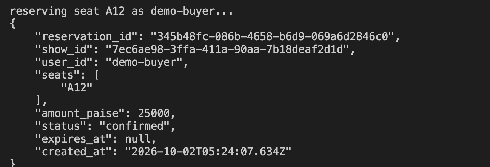
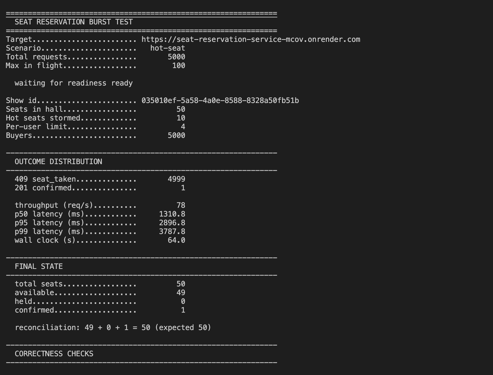
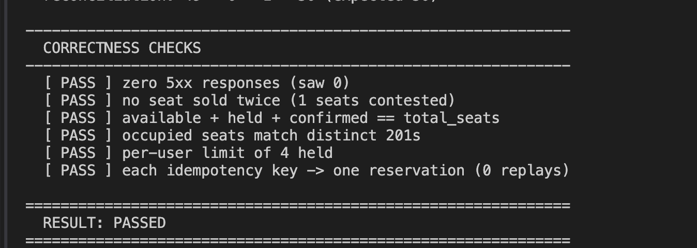

# Seat Reservation Service

Sells assigned seats under contention. A seat is never sold twice, a user
never exceeds their limit, and a retried request never books twice — even
when twenty thousand buyers hit the same show in the same second.

**Live:** https://seat-reservation-service-mcov.onrender.com
· [`/healthz`](https://seat-reservation-service-mcov.onrender.com/healthz)
· [`/readyz`](https://seat-reservation-service-mcov.onrender.com/readyz)
· [`/metrics`](https://seat-reservation-service-mcov.onrender.com/metrics)

NestJS 11 (Fastify) · PostgreSQL 16 · TypeORM for schema and migrations, raw
SQL on the reservation path · prom-client · pino.

> Render free tier: spins down after ~15 min idle, so a cold request takes
> ~50s (the burst script waits for readiness). The free database expires
> 2026-11-01.

---

## Verify it in one command

```bash
./burst.sh https://seat-reservation-service-mcov.onrender.com \
  --concurrency=100 --admin-token=<ADMIN_TOKEN>
```

20,000 requests (default), 200 in flight unless you say otherwise — use 100
against the free instance, which has 0.1 CPU. It creates its own show, mints
its own buyers, storms 10 hot seats, and mixes in cold-seat buyers, an
over-limit cohort and duplicate idempotency keys — then checks the result
against the service's own state and exits non-zero if anything is wrong.

Last run against the live instance:

```
  409 seat_taken..............      17890        throughput ....  108 req/s
  409 per_user_limit..........       1575        p50 / p95 / p99  897/2104/2991 ms
  201 confirmed...............        371
  201 idempotent replay.......        164        reconciliation: 129 + 0 + 371 = 500

  [PASS] zero 5xx (saw 0)              [PASS] no seat sold twice
  [PASS] available+held+confirmed==500 [PASS] occupied == distinct 201s
  [PASS] per-user limit held           [PASS] one reservation per key
  RESULT: PASSED
```

The same burst on a local container does **1,334 req/s at p99 912ms**. The gap
is the free instance (0.1 CPU) and the network hop; the correctness results
are identical, which is the part that matters.

If a run reports `502 SERVER ERROR (edge/proxy, no app response)`, the free
instance was recycled mid-burst and Render's proxy answered the requests in
flight — the application never saw them, and `http_server_errors_total` stays
at zero. The run still fails, correctly; the label just distinguishes a
recycled instance from a service bug. Re-run once the instance is stable, and
don't start a burst immediately after an env change, which triggers a
redeploy.

Other scenarios: `--scenario=hot-seat` (everyone on one seat), `stampede`,
`user-limit`, `idempotent`. Flags: `--requests`, `--concurrency`, `--seats`,
`--hot-seats`, `--hold-seconds`.

---

## Run it

```bash
docker compose up -d --build      # what the deploy does; migrations run on boot
make test                         # 30 integration tests on a disposable postgres
make dev                          # local server + dockerised postgres, hot reload
```

Swagger UI at `http://localhost:3000/docs` (dev only — off when
`NODE_ENV=production`). `POST /auth/token`, copy the token, hit **Authorize**.

---

## API

Money is integer paise throughout. Identity always comes from the JWT subject;
a `user_id` in a request body is stripped and ignored.

| Endpoint | Auth | Notes |
|---|---|---|
| `POST /auth/token` | — | Dev identity shim → JWT. `/auth/tokens/bulk` mints many. |
| `POST /shows` | `X-Admin-Token` | Creates the show and all seats in one transaction. |
| `GET /shows/{id}` | — | Per-seat state, counts, `reconciled` flag. |
| `POST /shows/{id}/reserve` | Bearer | The contended path. |
| `POST /reservations/{id}/confirm` | owner | Promotes a hold. |
| `POST /reservations/{id}/cancel` | owner | Idempotent. Non-owner gets 404, not 403. |
| `GET /healthz` · `/readyz` | — | Liveness (no DB) · readiness (fails closed, 503). |
| `GET /metrics` | — | Prometheus. |

### Reserve

```bash
curl -X POST $URL/shows/$SHOW_ID/reserve \
  -H "authorization: Bearer $TOKEN" -H 'content-type: application/json' \
  -H 'idempotency-key: 7f3c9a21' \
  -d '{"seats":["A12"]}'
```

```json
{ "reservation_id": "…", "show_id": "…", "user_id": "alice",
  "seats": ["A12"], "amount_paise": 25000, "status": "confirmed",
  "expires_at": null, "created_at": "2026-10-02T04:25:13.648Z" }
```

- **All-or-nothing.** If any requested seat is taken, nothing is reserved and
  the response names the seats that blocked it.
- Add `"hold_seconds": 120` for a time-boxed hold instead of an immediate
  confirmation; it auto-expires and the seat becomes re-bookable.
- The idempotency key may be the `Idempotency-Key` header or an
  `idempotency_key` body field. Header wins.

| Outcome | Status | `error.code` |
|---|---|---|
| Reserved | 201 | — |
| Retry, same key and body | 201 + `idempotent_replay: true` | — |
| Seat held or confirmed | 409 | `seat_taken` |
| Over the per-user limit | 409 | `per_user_limit` |
| Same key, different body | 409 | `idempotency_key_reuse` |
| Unknown show or seat | 404 | `show_not_found`, `seat_not_found` |
| Pool saturated | 429 | `service_busy` |
| Database unreachable | 503 | `dependency_unavailable` |

---

## Observability

**Metrics.** `reservations_confirmed_total`,
`reservations_declined_total{reason}`, `seats_available|held|confirmed{show_id}`,
`seats_reconciliation_ok`, `http_server_errors_total{route}`,
`reservation_tx_retries_total{sqlstate}`, `db_pool_waiting_requests`, plus
duration histograms.

Seat gauges are computed from the database **at scrape time**, so they
reconcile with `GET /shows/{id}` by construction rather than by us remembering
to decrement a counter.

**Logs.** pino JSON on stdout, every line carrying `request_id` — taken from
an inbound `X-Request-Id` when present, echoed back on the response, and
propagated through `AsyncLocalStorage` so no call site has to thread it.
Successful responses are sampled 1-in-`LOG_SAMPLE_RATE`; **every** non-2xx is
logged in full, because declines are the interesting part of a burst.

```json
{"level":"info","request_id":"…","user_id":"alice","show_id":"…","seats":["A12"],
 "outcome":"declined","reason":"seat_taken","msg":"reservation declined"}
```

**Watching it live.** Render's free tier keeps logs behind the dashboard, so
here is a screen recording of the live logs during a hot-seat burst — 5,000
buyers fighting over one seat, against the deployed instance:

### 📹 [Live logs under load (Loom)](https://www.loom.com/share/dc9939be3bf14733b9c71d237c2bdf26)

Reproduce it yourself against the live instance:

```bash
./burst.sh https://seat-reservation-service-mcov.onrender.com \
  --requests=5000 --concurrency=100 --scenario=hot-seat --seats=50 \
  --admin-token=<ADMIN_TOKEN>
```

Locally, `docker compose logs -f api` shows the same stream.

---

## Evidence from that run

A single reservation first, so one log line is readable before the flood —
note `user_id` comes from the token, and `amount_paise` is an integer:



Then 5,000 buyers on one seat. **Exactly one 201, 4,999 clean 409s, and the
hall still reconciles:**





Throughput here (78 req/s) is lower than the 20k mixed run above because every
one of these 5,000 requests targets the same row — this is the worst case the
design exists for, and it still returns zero 5xx.

---

## Configuration

Everything has a working default — see `.env.example`. The ones that matter:

| Variable | Default | Why you'd change it |
|---|---|---|
| `DB_POOL_MAX` | `15` | Keep well under the server's `max_connections`. |
| `IDEMPOTENCY_WAIT_MS` | `2000` | Must exceed p99 reservation latency, or honest retries get `request_in_flight`. `6000` on the free tier. |
| `DEFAULT_PER_USER_LIMIT` | `4` | |
| `TX_MAX_RETRIES` | `3` | Retries `40001`/`40P01`/`55P03` only. |
| `LOG_SAMPLE_RATE` | `20` | 1-in-N successes; errors always logged. |
| `SWAGGER_ENABLED` | on, except production | |

## Deploy

`render.yaml` is a Render blueprint (Docker web service + free Postgres):
point Render at the repo, apply, done. Secrets are generated, `DATABASE_URL`
is wired from the database, and the health check path is `/readyz` so traffic
is only routed once the database is reachable.

> The current live instance was provisioned manually — the blueprint is the
> intended path and is kept in sync, but it has not itself been applied
> end-to-end.

---

**[WRITEUP.md](WRITEUP.md)** — the atomicity mechanism, the idempotency
protocol, the CAP position, what I'd get paged for, and AI usage.
